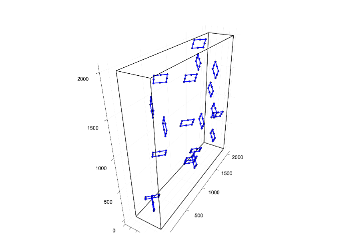
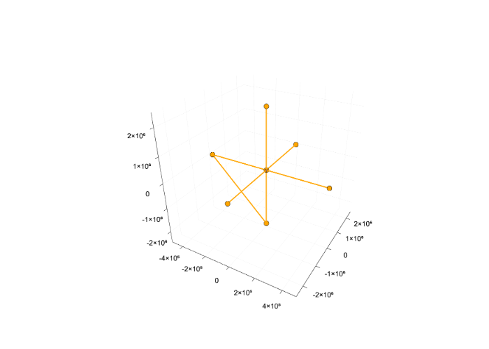
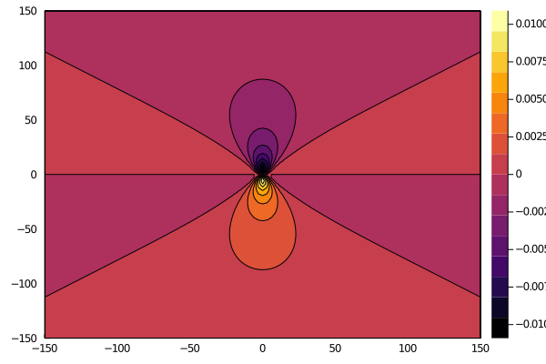
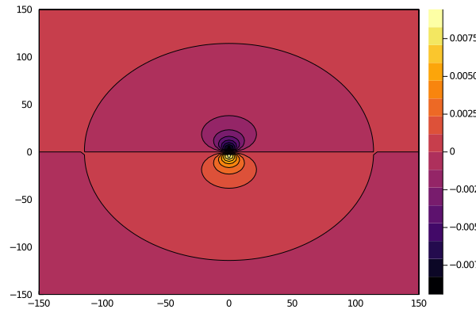
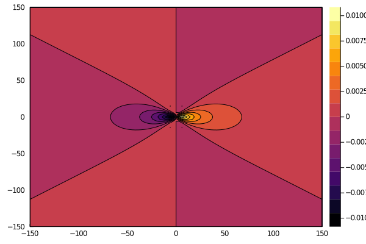
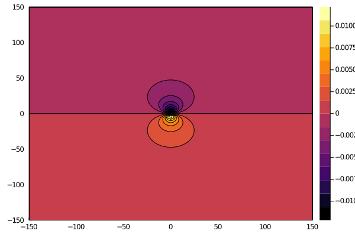
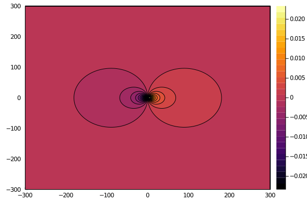
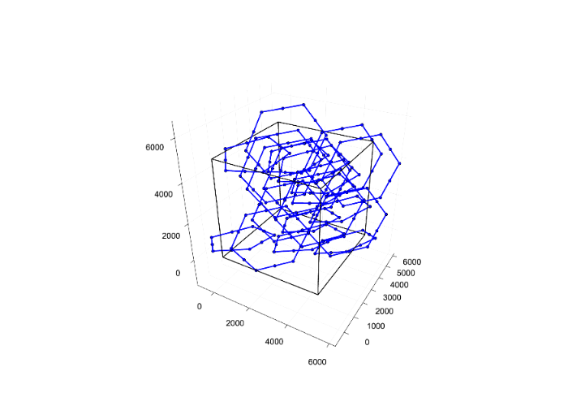

# DDD

<!-- [](https://dcelisgarza.github.io/DDD.jl/stable) -->
[](https://dcelisgarza.github.io/DDD.jl/dev)
[](https://travis-ci.com/dcelisgarza/DDD.jl)
[](https://ci.appveyor.com/project/dcelisgarza/DDD-jl)
[](https://codecov.io/gh/dcelisgarza/DDD.jl)
[](https://coveralls.io/github/dcelisgarza/DDD.jl?branch=master)
[](https://mybinder.org/v2/gh/dcelisgarza/DDD.jl/HEAD?urlpath=demo.ipynb)

## Demo of current capabilities

For an interactive demo of its current capabilities click the Binder banner above.

## Aim

The aim is to create a next-gen 3D dislocation dynamic code that is.

- Easy to use.
- Easy to maintain.
- Easy to develop for.
- Modular.
- Idiot proof.
- Well documented and tested.
- Performant.
- Easily parallelisable.

## Checklist of capabilities

- [x] Building regular cuboid mesh. >10x faster than `Matlab`.
  - [x] Sets of corners, edges and surfaces.
- [ ] Loading conditions.
  - [x] Structure for boundary conditions.
  - [ ] Procedure to generate boundary conditions.
    - [x] Cantilever boundary conditions.
  - [ ] Loading function.
- [x] Forces
  - [x] Peach-Koehler force for regular cuboid mesh. ~10x faster than `Matlab`.
  - [ ] Peach-Koehler force for infinite domain (`σHat` is an input rather than calculated via FEM).
  - [x] `O(N^2)` Segment-segment force.  ~1.1x faster than `C`.
    - [x] Serial
    - [x] CPU parallelised
  - [x] Self-forces. ~10x faster than `Matlab`.
- [ ] Topology
  - [x] Internal remeshing.
    - [x] Mesh refinement. >100x faster than `Matlab`.
    - [x] Mesh coarsening. ~3x faster than `Matlab`.
  - [x] Surface remeshing (untested).
    - Original network before surface remeshing. 
    - External segments projected orthongonally to the face they exited from, if they were external to begin with and no intersection with the surfaces is found, project along the normal of the plane of the volume's surfaces whose orthogonal distance to the point is shortest. 
    - Cyan nodes are surface nodes, their virtual segments (those things jutting out of the volume) are orthogonal to the face they sit on. 
  - [ ] Collision.
    - [x] Collision detection.
    - [ ] Collision resolution.
      - [x] Untested.
  - [ ] Separation.
- [ ] DDD-FEM coupling.
  - [ ] Displacements.
  - [ ] Tractions.
    - [x] Field point stresses. ~1.3x faster than `C`.
      - Edge sxx 
      - Edge syy 
      - Edge szz 
      - Edge sxy 
      - Screw xz 
      - Screw yz 
- [ ] Integrators
  - [x] Predictor corrector trapezoid (untested).
- [ ] Mobility laws
  - [x] Outdated BCC mobility law.
  - [ ] FCC
  - [ ] BCC
  - [ ] HCP

## Example

Before running a simulation we need to initialise some variables simulation. For this example, we will use the keyword initialisers because it makes it clear what we're doing. The positional and keyword constructors calculate derived quantities, perform input validations and provide default values. Keyword constructors also make the code easier to read.

First, we'll define the parameters for a simulation. The recommended way is to load them from `json` files.

```julia
julia> fileDislocationParameters = "./inputs/simParams/sampleDislocationParameters.json"
"./inputs/simParams/sampleDislocationParameters.json"

julia> fileMaterialParameters = "./inputs/simParams/sampleMaterialParameters.json"
"./inputs/simParams/sampleMaterialParameters.json"

julia> fileFEMParameters = "./inputs/simParams/sampleFEMParameters.json"
"./inputs/simParams/sampleFEMParameters.json"

julia> fileIntegrationParameters = "./inputs/simParams/sampleIntegrationParameters.json"
"./inputs/simParams/sampleIntegrationParameters.json"

julia> fileSlipSystem = "./data/slipSystems/BCC.json"
"./data/slipSystems/BCC.json"

julia> fileDislocationLoop = "./inputs/dln/samplePrismShear.json"
"./inputs/dln/samplePrismShear.json"

julia> fileIntVar = "./inputs/simParams/sampleIntegrationTime.json"
"./inputs/simParams/sampleIntegrationTime.json"

julia> intVars = loadIntegrationTime(fileIntVar)
IntegrationTime{Float64,Int64}(100.0, 0.0, 0)

julia> dlnParams, matParams, femParams, intParams, slipSystems, dislocationLoop =
           loadParameters(
               fileDislocationParameters,
               fileMaterialParameters,
               fileFEMParameters,
               fileIntegrationParameters,
               fileSlipSystem,
               fileDislocationLoop,
       )
(DislocationParameters{Float64,Int64,mobBCC,Bool}(90.78, 8241.0084, 0.0, 314.47, 1572.33, 628.94, 49444.25, 988884.93, 2.4447338580625e9, 9.77893404781105e11, 1.0, 2.0, 1.0e10, 0.0, 4, mobBCC(), true, true, true, true, false, false, 786.165, 5393.277083825736), MaterialParameters{Float64,BCC}(1.0, 145000.0, 0.28, 1.0, 1.3888888888888888, 0.78125, 0.3888888888888889, 0.21875000000000003, 0.07957747154594767, 0.039788735772973836, 0.11052426603603843, BCC(), 0.0), FEMParameters{DispatchRegularCuboidMesh,LinearElement,Float64,Int64}(DispatchRegularCuboidMesh(), LinearElement(), 2000.0, 2000.0, 2000.0, 5, 5, 5), IntegrationParameters{AdaptiveEulerTrapezoid,Float64,Int64}(AdaptiveEulerTrapezoid(), 0.0, 1.0e13, 1.0e-6, 1.0e15, 10.0, 1.0, 1.2, 20.0, 20), SlipSystem{BCC,StaticArrays.SArray{Tuple{3,12},Float64,2,36}}(BCC(), [1.0 1.0 … 0.0 0.0; 1.0 1.0 … -1.0 -1.0; 0.0 0.0 … 1.0 1.0], [-1.0 
1.0 … 1.0 -1.0; 1.0 -1.0 … 1.0 1.0; 1.0 1.0 … 1.0 1.0]), DislocationLoop[DislocationLoop{loopPrism,Int64,StaticArrays.SArray{Tuple{24},Float64,1,24},Int64,StaticArrays.MArray{Tuple{2,24},Int64,2,48},StaticArrays.MArray{Tuple{3,24},Float64,2,72},StaticArrays.SArray{Tuple{24},nodeTypeDln,1,24},Float64,StaticArrays.SArray{Tuple{3,2},Float64,2,6},Zeros}(loopPrism(), 12, 2, 3, [3.0, 2.0, 1.0, 1.0, 2.0, 3.0, 3.0, 2.0, 1.0, 1.0  …  1.0, 1.0, 2.0, 3.0, 3.0, 2.0, 1.0, 1.0, 2.0, 3.0], 1, [1 2 … 23 24; 2 3 … 24 1], [0.7071067811865475 0.7071067811865475 … 0.7071067811865475 0.7071067811865475; 0.7071067811865475 0.7071067811865475 … 0.7071067811865475 0.7071067811865475; 0.0 0.0 … 0.0 0.0], [-0.5773502691896258 -0.5773502691896258 … -0.5773502691896258 -0.5773502691896258; 0.5773502691896258 0.5773502691896258 … 0.5773502691896258 0.5773502691896258; 0.5773502691896258 0.5773502691896258 … 0.5773502691896258 0.5773502691896258], [-3.7543135054151 -2.529568634023511 … -4.979058376806686 -4.979058376806689; -4.869668577065509 -6.094413448457098 … -1.5236033621142662 -3.6449237056739108; 1.1153550716504115 3.5648448144335894 … -3.45545501469242 -1.3341346711327793], nodeTypeDln[DDD.intFixDln, DDD.intMobDln, DDD.intFixDln, DDD.intMobDln, DDD.intFixDln, DDD.intMobDln, DDD.intFixDln, DDD.intMobDln, DDD.intFixDln, DDD.intMobDln  …  DDD.intFixDln, DDD.intMobDln, DDD.intFixDln, DDD.intMobDln, DDD.intFixDln, DDD.intMobDln, DDD.intFixDln, DDD.intMobDln, DDD.intFixDln, DDD.intMobDln], 0.0, [-100.0 100.0; -100.0 100.0; -100.0 100.0], Zeros()), DislocationLoop{loopShear,Int64,StaticArrays.SArray{Tuple{24},Float64,1,24},Int64,StaticArrays.MArray{Tuple{2,24},Int64,2,48},StaticArrays.MArray{Tuple{3,24},Float64,2,72},StaticArrays.SArray{Tuple{24},nodeTypeDln,1,24},Float64,StaticArrays.SArray{Tuple{3,2},Float64,2,6},Zeros}(loopShear(), 12, 2, 3, [3.0, 2.0, 1.0, 1.0, 2.0, 3.0, 3.0, 2.0, 1.0, 1.0  …  1.0, 1.0, 2.0, 3.0, 3.0, 2.0, 1.0, 1.0, 2.0, 3.0], 1, [1 2 … 23 24; 2 3 … 24 1], [0.7071067811865475 0.7071067811865475 … 0.7071067811865475 0.7071067811865475; 0.7071067811865475 0.7071067811865475 … 0.7071067811865475 0.7071067811865475; 0.0 0.0 … 0.0 0.0], [-0.5773502691896258 -0.5773502691896258 … -0.5773502691896258 -0.5773502691896258; 0.5773502691896258 0.5773502691896258 … 0.5773502691896258 0.5773502691896258; 0.5773502691896258 0.5773502691896258 … 0.5773502691896258 0.5773502691896258], [-2.9630484063384888 -1.7383035349468998 … -4.382428045725459 -4.187793277730079; 2.9630484063384888 1.7383035349468998 … 4.382428045725459 4.187793277730079; 4.636081013814105 7.085570756597283 … 
-0.8007544763131689 2.1865912710309123], nodeTypeDln[DDD.intFixDln, DDD.intMobDln, DDD.intFixDln, DDD.intMobDln, DDD.intFixDln, DDD.intMobDln, DDD.intFixDln, DDD.intMobDln, DDD.intFixDln, DDD.intMobDln  …  DDD.intFixDln, DDD.intMobDln, DDD.intFixDln, DDD.intMobDln, DDD.intFixDln, DDD.intMobDln, DDD.intFixDln, DDD.intMobDln, DDD.intFixDln, DDD.intMobDln], 0.0, [-100.0 100.0; -100.0 100.0; -100.0 100.0], Zeros())])
```

However, we can also manually generate them using the constructors. Here we use keyword constructors, which provide default values and automatically calculate auxiliary parameters.

```julia
julia> dlnParams = DislocationParameters(;
          coreRad = 100.0,
          coreRadMag = 1e-4,
          minSegLen = 250.0,
          maxSegLen = 650.0,
          minArea = 5e4,
          maxArea = 1e6,
          edgeDrag = 1.0,
          screwDrag = 1.0,
          climbDrag = 1e10,
          lineDrag = 1e-3,
          maxConnect = 4,
          mobility = mobBCC(),
       )
DislocationParameters{Float64,Int64,mobBCC,Bool}(100.0, 10000.0, 0.0001, 250.0, 650.0, 500.0, 50000.0, 1.0e6, 2.5e9, 1.0e12, 1.0, 1.0, 1.0e10, 0.001, 4, mobBCC(), true, true, true, true, false, false, 325.0, 921.7052149690354)

julia> matParams = MaterialParameters(;
          μ = 1.0,
          μMag = 1.45e5,
          ν = 0.28,
          E = 1.0,
          crystalStruct = BCC(),
       )
MaterialParameters{Float64,BCC}(1.0, 145000.0, 0.28, 1.0, 1.3888888888888888, 0.78125, 0.3888888888888889, 0.21875000000000003, 0.07957747154594767, 0.039788735772973836, 0.11052426603603843, BCC(), 0.0)

julia> femParams = FEMParameters(;
          type = DispatchRegularCuboidMesh(),
          order = LinearElement(),
          dx = 5000.0,
          dy = 5000.0,
          dz = 5000.0,
          mx = 50,
          my = 50,
          mz = 50
       )
FEMParameters{DispatchRegularCuboidMesh,LinearElement,Float64,Int64}(DispatchRegularCuboidMesh(), LinearElement(), 5000.0, 5000.0, 5000.0, 50, 50, 50)

julia> integParams = IntegrationParameters(;
          method = AdaptiveEulerTrapezoid(),
          tmin = 0.0,
          tmax = 1e13,
       )
IntegrationParameters{AdaptiveEulerTrapezoid,Float64,Int64}(AdaptiveEulerTrapezoid(), 0.0, 1.0e13, 0.001, Inf, 1.0e-6, 1.0e-6, 1.2, 20.0, 10)

julia> slipSystem = SlipSystem(;
          crystalStruct = BCC(),
          slipPlane = Float64[1 -1; 1 1; 0 0],
          bVec = Float64[-1 1; 1 1; 1 1]
       )
SlipSystem{BCC,Array{Float64,2}}(BCC(), [1.0 -1.0; 1.0 1.0; 0.0 0.0], [-1.0 1.0; 1.0 1.0; 1.0 1.0])
```

We can use these parameters to define new dislocation loops. We'll create prismatic pentagonal and shear hexagonal loops. We're making really big loops to show that we can detect nodes that have exited the FE domain later on.

```julia
julia> segLen = (dlnParams.minSegLen + dlnParams.maxSegLen) / 2
943.4

julia> dx, dy, dz = femParams.dx, femParams.dy, femParams.dz
(5000.0, 5000.0, 5000.0)

julia> prismPentagon = DislocationLoop(;
           loopType = loopPrism(),
           numSides = 5,
           nodeSide = 2,
           numLoops = 10,
           segLen = segLen * ones(10),
           slipSystem = 1,
           _slipPlane = slipSystem.slipPlane[:, 1],
           _bVec = slipSystem.bVec[:, 1],
           label = nodeTypeDln.(ones(Int, 10)),
           buffer = 0,
           range = [0 femParams.dx; 0 femParams.dy; 0 femParams.dz],
           dist = Rand(),
       )
DislocationLoop{loopPrism,Int64,Array{Float64,1},Int64,StaticArrays.MArray{Tuple{2,10},Int64,2,20},StaticArrays.MArray{Tuple{3,10},Float64,2,30},Array{nodeTypeDln,1},Int64,Array{Float64,2},Rand}(loopPrism(), 5, 2, 10, [943.4, 943.4, 943.4, 943.4, 943.4, 943.4, 943.4, 943.4, 943.4, 943.4], 1, [1 2 … 9 10; 2 3 … 10 1], [0.7071067811865475 0.7071067811865475 … 0.7071067811865475 0.7071067811865475; 0.7071067811865475 0.7071067811865475 … 0.7071067811865475 0.7071067811865475; 0.0 0.0 … 0.0 0.0], [-0.5773502691896258 -0.5773502691896258 … -0.5773502691896258 -0.5773502691896258; 0.5773502691896258 0.5773502691896258 … 0.5773502691896258 0.5773502691896258; 0.5773502691896258 0.5773502691896258 … 0.5773502691896258 0.5773502691896258], [-918.1630966638565 -533.0216594402482 … -787.8846870407546 -1303.304533887465; -918.1630966638565 -1303.304533887465 … 220.4286860866364 -533.021659440248; 7.958078640513122e-14 770.2828744472168 … -1008.3133731273906 -770.2828744472168], nodeTypeDln[DDD.intMobDln, DDD.intMobDln, DDD.intMobDln, DDD.intMobDln, DDD.intMobDln, DDD.intMobDln, DDD.intMobDln, DDD.intMobDln, DDD.intMobDln, DDD.intMobDln], 0, [0.0 2000.0; 0.0 2000.0; 0.0 2000.0], Rand())

julia> shearHexagon = DislocationLoop(;
           loopType = loopShear(),
           numSides = 6,
           nodeSide = 2,
           numLoops = 10,
           segLen = segLen * ones(12),
           slipSystem = 1,
           _slipPlane = slipSystem.slipPlane[:, 2],
           _bVec = slipSystem.bVec[:, 2],
           label = nodeTypeDln.(ones(Int, 12)),
           buffer = 0,
           range = [0 femParams.dx; 0 femParams.dy; 0 femParams.dz],
           dist = Rand(),
       )
DislocationLoop{loopShear,Int64,Array{Float64,1},Int64,StaticArrays.MArray{Tuple{2,12},Int64,2,24},StaticArrays.MArray{Tuple{3,12},Float64,2,36},Array{nodeTypeDln,1},Int64,Array{Float64,2},Rand}(loopShear(), 6, 2, 10, [943.4, 943.4, 943.4, 
943.4, 943.4, 943.4, 943.4, 943.4, 943.4, 943.4, 943.4, 943.4], 1, [1 2 … 11 12; 2 3 … 12 1], [-0.7071067811865475 -0.7071067811865475 … -0.7071067811865475 -0.7071067811865475; 0.7071067811865475 0.7071067811865475 … 0.7071067811865475 
0.7071067811865475; 0.0 0.0 … 0.0 0.0], [0.5773502691896258 0.5773502691896258 … 0.5773502691896258 0.5773502691896258; 0.5773502691896258 0.5773502691896258 … 0.5773502691896258 0.5773502691896258; 0.5773502691896258 0.5773502691896258 
… 0.5773502691896258 0.5773502691896258], [943.3999999999996 1328.541437223608 … -106.01215583541216 558.258562776392; 943.3999999999996 1328.541437223608 … -106.01215583541216 558.258562776392; 943.3999999999995 173.1171255527828 … 1627.1243116708247 1713.682874447215], nodeTypeDln[DDD.intMobDln, DDD.intMobDln, DDD.intMobDln, DDD.intMobDln, DDD.intMobDln, DDD.intMobDln, DDD.intMobDln, DDD.intMobDln, DDD.intMobDln, DDD.intMobDln, DDD.intMobDln, DDD.intMobDln], 0, [0.0 5000.0; 0.0 5000.0; 0.0 5000.0], Rand())
```

We can then create a network from these two dislocations.

```julia
julia> network = DislocationNetwork((prismPentagon, shearHexagon))
DislocationNetwork{Array{Int64,2},Array{Float64,2},Array{nodeTypeDln,1},Array{Int64,1},Int64,Array{Float64,3}}([1 2 … 0 0; 2 3 … 0 0], [0.7071067811865475 0.7071067811865475 … 0.0 0.0; 0.7071067811865475 0.7071067811865475 … 0.0 0.0; 0.0 0.0 … 0.0 0.0], [-0.5773502691896258 -0.5773502691896258 … 0.0 
0.0; 0.5773502691896258 0.5773502691896258 … 0.0 0.0; 0.5773502691896258 0.5773502691896258 … 0.0 0.0], [-642.7877450115786 -257.6463077879703 … 0.0 
0.0; 222.94211475290717 -162.1993224707012 … 0.0 0.0; 678.3283402449995 1448.6112146922162 … 0.0 0.0], nodeTypeDln[DDD.intMobDln, DDD.intMobDln, DDD.intMobDln, DDD.intMobDln, DDD.intMobDln, DDD.intMobDln, DDD.intMobDln, DDD.intMobDln, DDD.intMobDln, DDD.intMobDln  …  DDD.noneDln, DDD.noneDln, DDD.noneDln, DDD.noneDln, DDD.noneDln, DDD.noneDln, DDD.noneDln, DDD.noneDln, DDD.noneDln, DDD.noneDln], [0.0 0.0 … 0.0 0.0; 0.0 0.0 … 0.0 0.0; 0.0 0.0 … 0.0 0.0], [0.0 0.0 … 0.0 0.0; 0.0 0.0 … 0.0 0.0; 0.0 0.0 … 0.0 0.0], [280], [280], 4, [2 2 … 0 0; 1 1 … 0 0; … ; 0 0 … 0 0; 0 0 … 0 0], [1 2 … 0 0; 1 1 … 0 0], [1 1 2; 2 2 3; … ; 0 0 0; 0 0 0], [0.0 0.0; 0.0 0.0; 0.0 0.0]

[0.0 0.0; 0.0 0.0; 0.0 0.0]

[0.0 0.0; 0.0 0.0; 0.0 0.0]

...

[0.0 0.0; 0.0 0.0; 0.0 0.0]

[0.0 0.0; 0.0 0.0; 0.0 0.0]

[0.0 0.0; 0.0 0.0; 0.0 0.0])
```

We can also create a regular cuboid mesh for our FE domain.

```julia
julia> regularCuboidMesh = buildMesh(matParams, femParams)
RegularCuboidMesh{LinearElement,LazySets.VPolytope{Float64,StaticArrays.SArray{Tuple{3},Float64,1,3}},StaticArrays.SArray{Tuple{6,6},Float64,2,36},Float64,Int64,Array{Float64,3},Array{Float64,2},Array{Int64,2},SparseArrays.SparseMatrixCSC{Float64,Int64}}(LinearElement(), LazySets.VPolytope{Float64,StaticArrays.SArray{Tuple{3},Float64,1,3}}(StaticArrays.SArray{Tuple{3},Float64,1,3}[[0.0, 0.0, 0.0], [5000.0, 0.0, 0.0], [0.0, 5000.0, 0.0], [5000.0, 5000.0, 0.0], [0.0, 0.0, 5000.0], [5000.0, 0.0, 5000.0], [0.0, 5000.0, 5000.0], [5000.0, 5000.0, 5000.0]]), [3.272727272727273 1.272727272727273 … 0.0 0.0; 1.272727272727273 3.272727272727273 … 0.0 0.0; … ; 0.0 0.0 … 1.0 0.0; 0.0 0.0 … 0.0 1.0], 5000.0, 5000.0, 5000.0, 50, 50, 50, 125000, 132651, 100.0, 100.0, 100.0, [-0.0062200846792814625 0.0 … 0.0 0.0; 0.0 0.006220084679281463 … -0.0016666666666666666 0.0; … ; -0.006220084679281463 0.0 … 0.0 -0.0004465819873852044; 0.0 -0.006220084679281463 … 0.0016666666666666666 -0.0016666666666666666]

[-0.0062200846792814625 0.0 … 0.0 0.0; 0.0 0.0016666666666666668 … -0.0004465819873852044 0.0; … ; -0.0016666666666666666 0.0 … 0.0 -0.00044658198738520435; 0.0 -0.0016666666666666666 … 0.00044658198738520445 -0.0004465819873852044]

[-0.0016666666666666663 0.0 … 0.0 0.0; 0.0 0.00044658198738520445 … -0.0016666666666666666 0.0; … ; -0.0016666666666666666 0.0 … 0.0 -0.0016666666666666663; 0.0 -0.0016666666666666666 … 0.00044658198738520445 -0.0016666666666666666]

[-0.0016666666666666663 0.0 … 0.0 0.0; 0.0 0.0016666666666666666 … -0.006220084679281463 0.0; … ; -0.006220084679281463 0.0 … 0.0 -0.0016666666666666663; 0.0 -0.006220084679281463 … 0.0016666666666666666 -0.006220084679281463]

[-0.0016666666666666663 0.0 … 0.0 0.0; 0.0 0.006220084679281463 … -0.0016666666666666663 0.0; … ; -0.0016666666666666666 0.0 … 0.0 -0.0016666666666666663; 0.0 -0.0016666666666666666 … 0.006220084679281463 -0.0016666666666666663]

[-0.0016666666666666663 0.0 … 0.0 0.0; 0.0 0.0016666666666666666 … -0.00044658198738520435 0.0; … ; -0.00044658198738520445 0.0 … 0.0 -0.0016666666666666663; 0.0 -0.00044658198738520445 … 0.0016666666666666666 -0.00044658198738520435]

[-0.00044658198738520435 0.0 … 0.0 0.0; 0.0 0.00044658198738520445 … -0.0016666666666666663 0.0; … ; -0.00044658198738520445 0.0 … 0.0 -0.0062200846792814625; 0.0 -0.00044658198738520445 … 0.0016666666666666666 -0.0016666666666666663]

[-0.00044658198738520435 0.0 … 0.0 0.0; 0.0 0.0016666666666666666 … -0.006220084679281463 0.0; … ; -0.0016666666666666666 0.0 … 0.0 -0.0062200846792814625; 0.0 -0.0016666666666666666 … 0.006220084679281463 -0.006220084679281463], [0.0 100.0 … 4900.0 5000.0; 0.0 0.0 … 5000.0 5000.0; 0.0 0.0 … 5000.0 5000.0], [2602 2603 … 132598 132599; 2603 2604 … 132599 132600; … ; 53 54 … 130049 130050; 52 53 … 130048 130049],
  [1     ,      1]  =  58.5859
  [2     ,      1]  =  18.9394
  [3     ,      1]  =  18.9394
  [4     ,      1]  =  -25.2525
  [5     ,      1]  =  2.27273
  [6     ,      1]  =  2.27273
  [154   ,      1]  =  12.6263
  ⋮
  [397799, 397953]  =  2.27273
  [397800, 397953]  =  -25.2525
  [397948, 397953]  =  -2.27273
  [397949, 397953]  =  9.4697
  [397950, 397953]  =  12.6263
  [397951, 397953]  =  18.9394
  [397952, 397953]  =  18.9394
  [397953, 397953]  =  58.5859)
```

We can visualise the FE domain and dislocations.

```julia
julia> using Plots

julia> plotlyjs()
Plots.PlotlyJSBackend()

julia> fig = plotNodes(
    regularCuboidMesh, 
    network,
    m = 1,
    l = 3,
    linecolor = :blue,
    marker = :circle,
    markercolor = :blue,
    legend = false,
)
```

Which produces the following image, which as expected has really large dislocation loops.



In dislocation dynamics, external nodes do not contribute to the forces on internal nodes but are required to calculate displacements from dislocations. We now have the capability of finding these. We haven't yet fully implemented the remeshing to stop the code from accounting for them, but we will in the future.

## Fun stuff, neat stuff, slick stuff. -- G Brooks

The integration may be buggy, I haven't tested it yet. Coarsen and refine have passed every test i've thrown at them.

This shows network remeshing (coarsen and refining) and time integration with no applied stress.


This shows the same but without network coarsening.


This shows the same but without network refining and lower error bounds.


This is just the integration.


